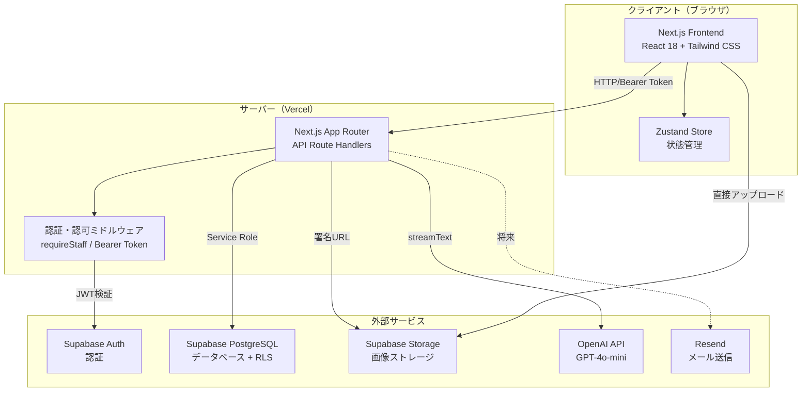

# 7. 技術アーキテクチャ

### システム構成図

> draw.io版: [07_技術アーキテクチャ.drawio](./07_技術アーキテクチャ.drawio)

### 各コンポーネントの役割

| コンポーネント | 役割 |
|---|---|
| `app/` | Next.js App Routerのページ定義とAPIルートハンドラ |
| `src/features/` | 機能別に整理されたUIコンポーネントとカスタムフック |
| `src/shared/lib/` | 共通ユーティリティ（認証、エラー処理、DB操作、バリデーション） |
| `src/shared/types/` | TypeScript型定義（Supabaseスキーマ） |
| `src/shared/utils/` | 汎用ユーティリティ（メッセージ変換等） |
| `supabase/migrations/` | データベースマイグレーション（DDL + RLS） |
| `scripts/` | 運用スクリプト（シード、権限付与、RLS検証） |
| `tests/` | Vitestテストスイート |

### 技術スタック

| カテゴリ | 技術 | バージョン |
|---|---|---|
| **フロントエンド** | Next.js (App Router) | 14.2.35 |
| | React | 18.3.1 |
| | TypeScript | 5.4.5 (strict) |
| | Tailwind CSS | 3.4.3 |
| | Zustand | 4.5.2 |
| | React Markdown + remark/rehype | 9.0.1 |
| | KaTeX | — |
| **バックエンド** | Next.js Route Handlers | Node.js Runtime |
| | Vercel AI SDK | 6.0.33 |
| | @ai-sdk/openai | 3.0.9 |
| | Zod | 4.3.5 |
| **データベース** | PostgreSQL | Supabase管理 |
| | Supabase JS Client | 2.45.0 |
| **認証** | Supabase Auth | — |
| **ストレージ** | Supabase Storage | — |
| **AI** | OpenAI GPT-4o-mini | — |
| **メール** | Resend | — |
| **テスト** | Vitest | 1.5.0 |
| | React Testing Library | 14.2.1 |
| **CI/CD** | GitHub Actions | — |
| **デプロイ** | Vercel | — |

---

> **文書バージョン**: 1.0
> **作成日**: 2026-03-01
> **最終更新日**: 2026-03-01
