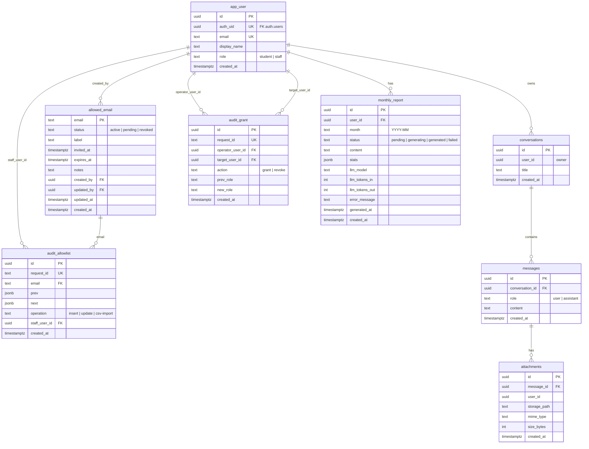

# 9. データベース設計

### ER図

> draw.io版: [09_データベース設計.drawio](./09_データベース設計.drawio)

### テーブル詳細

#### app_user

| カラム | 型 | 制約 | 説明 |
|---|---|---|---|
| id | uuid | PK, DEFAULT gen_random_uuid() | 内部ID |
| auth_uid | uuid | UNIQUE, NOT NULL | Supabase Auth ユーザーID |
| email | text | UNIQUE, NOT NULL | メールアドレス（小文字） |
| display_name | text | NULLABLE | 表示名 |
| role | text | NOT NULL, DEFAULT 'student' | `student` / `staff` |
| created_at | timestamptz | DEFAULT now() | 作成日時 |

#### allowed_email

| カラム | 型 | 制約 | 説明 |
|---|---|---|---|
| email | text | PK | メールアドレス（小文字） |
| status | text | NOT NULL, DEFAULT 'pending' | `active` / `pending` / `revoked` |
| label | text | NULLABLE | ラベル（氏名等） |
| invited_at | timestamptz | NULLABLE | 招待日時 |
| expires_at | timestamptz | NULLABLE | 有効期限 |
| notes | text | NULLABLE | 備考 |
| created_by | uuid | FK → app_user | 作成者 |
| updated_by | uuid | FK → app_user | 更新者 |
| updated_at | timestamptz | DEFAULT now() | 更新日時 |
| created_at | timestamptz | DEFAULT now() | 作成日時 |

#### conversations

| カラム | 型 | 制約 | 説明 |
|---|---|---|---|
| id | uuid | PK, DEFAULT gen_random_uuid() | 会話ID |
| user_id | uuid | NOT NULL | 所有ユーザーID |
| title | text | NOT NULL | 会話タイトル |
| created_at | timestamptz | DEFAULT now() | 作成日時 |

**インデックス**: `(user_id, created_at DESC)`

#### messages

| カラム | 型 | 制約 | 説明 |
|---|---|---|---|
| id | uuid | PK, DEFAULT gen_random_uuid() | メッセージID |
| conversation_id | uuid | FK → conversations (CASCADE DELETE), NOT NULL | 会話ID |
| role | text | NOT NULL | `user` / `assistant` |
| content | text | NOT NULL | メッセージ内容（Markdown） |
| created_at | timestamptz | DEFAULT now() | 作成日時 |

**インデックス**: `(conversation_id, created_at ASC)`

#### attachments

| カラム | 型 | 制約 | 説明 |
|---|---|---|---|
| id | uuid | PK, DEFAULT gen_random_uuid() | 添付ID |
| message_id | uuid | FK → messages (CASCADE DELETE), NOT NULL | メッセージID |
| user_id | uuid | NOT NULL | アップロードユーザーID |
| storage_path | text | NOT NULL | Storageパス `{user_id}/{uuid}.{ext}` |
| mime_type | text | NULLABLE | MIMEタイプ |
| size_bytes | int | NULLABLE | ファイルサイズ |
| created_at | timestamptz | DEFAULT now() | 作成日時 |

**インデックス**: `(message_id, created_at ASC)`

#### audit_allowlist

| カラム | 型 | 制約 | 説明 |
|---|---|---|---|
| id | uuid | PK | 監査ID |
| request_id | text | UNIQUE | リクエスト追跡ID |
| email | text | FK → allowed_email | 対象メール |
| prev | jsonb | NULLABLE | 変更前の状態 |
| next | jsonb | NULLABLE | 変更後の状態 |
| operation | text | NOT NULL | `insert` / `update` / `csv-import` |
| staff_user_id | uuid | FK → app_user | 操作スタッフ |
| created_at | timestamptz | DEFAULT now() | 操作日時 |

#### audit_grant

| カラム | 型 | 制約 | 説明 |
|---|---|---|---|
| id | uuid | PK | 監査ID |
| request_id | text | UNIQUE | リクエスト追跡ID |
| operator_user_id | uuid | FK → app_user | 操作者 |
| target_user_id | uuid | FK → app_user | 対象者 |
| action | text | NOT NULL | `grant` / `revoke` |
| prev_role | text | NOT NULL | 変更前ロール |
| new_role | text | NOT NULL | 変更後ロール |
| created_at | timestamptz | DEFAULT now() | 操作日時 |

**インデックス**: `(target_user_id, created_at DESC)`

#### monthly_report

| カラム | 型 | 制約 | 説明 |
|---|---|---|---|
| id | uuid | PK | レポートID |
| user_id | uuid | FK → app_user (CASCADE DELETE) | 対象ユーザー |
| month | text | NOT NULL | 対象月 `YYYY-MM` |
| status | text | NOT NULL, DEFAULT 'pending' | `pending` / `generating` / `generated` / `failed` |
| content | text | NULLABLE | レポート本文（Markdown） |
| stats | jsonb | NULLABLE | 統計情報 |
| llm_model | text | NULLABLE | 使用LLMモデル名 |
| llm_tokens_in | int | DEFAULT 0 | 入力トークン数 |
| llm_tokens_out | int | DEFAULT 0 | 出力トークン数 |
| error_message | text | NULLABLE | エラーメッセージ |
| generated_at | timestamptz | NULLABLE | 生成完了日時 |
| created_at | timestamptz | DEFAULT now() | 作成日時 |

**ユニーク制約**: `(user_id, month)`
**インデックス**: `(month)`, `(user_id, month)`

### RLSポリシー

| テーブル | ポリシー | 条件 |
|---|---|---|
| conversations | SELECT/INSERT/UPDATE/DELETE | `user_id = auth.uid()` または staff |
| messages | SELECT/INSERT/UPDATE/DELETE | 親conversationのuser_id = auth.uid() または staff |
| attachments | SELECT/INSERT/UPDATE/DELETE | 親conversationのuser_id = auth.uid() または staff |
| allowed_email | SELECT | 自身のメール一致（`email = auth.jwt()->email`） |
| monthly_report | SELECT | 自身のレポート（`user_id = auth.uid()`）または staff |
| audit_allowlist | — | Service Role のみアクセス可 |
| audit_grant | — | Service Role のみアクセス可 |

---

> **文書バージョン**: 1.0
> **作成日**: 2026-03-01
> **最終更新日**: 2026-03-01
