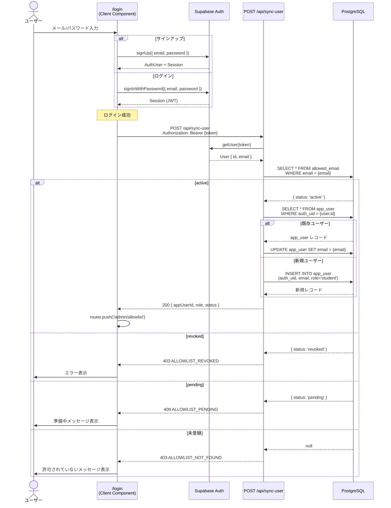
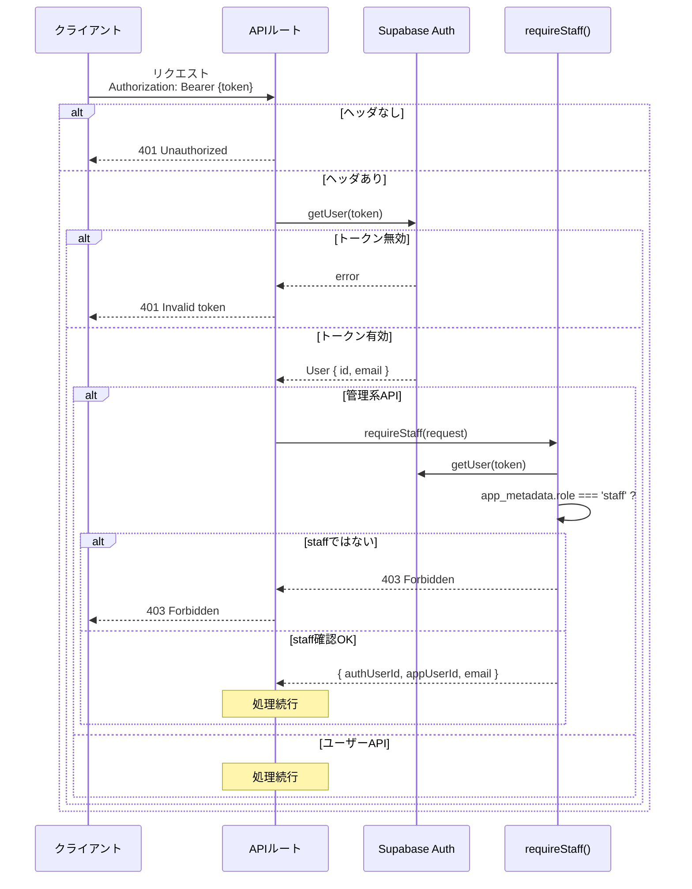

# 2. ユーザー認証フロー

### 2.1 ログイン・サインアップ

```mermaid
sequenceDiagram
    actor User as ユーザー
    participant Login as /login<br/>(Client Component)
    participant Auth as Supabase Auth
    participant API as POST /api/sync-user
    participant DB as PostgreSQL

    User->>Login: メール/パスワード入力

    alt サインアップ
        Login->>Auth: signUp({ email, password })
        Auth-->>Login: AuthUser + Session
    else ログイン
        Login->>Auth: signInWithPassword({ email, password })
        Auth-->>Login: Session (JWT)
    end

    Note over Login: ログイン成功

    Login->>API: POST /api/sync-user<br/>Authorization: Bearer {token}
    API->>Auth: getUser(token)
    Auth-->>API: User { id, email }

    API->>DB: SELECT * FROM allowed_email<br/>WHERE email = {email}

    alt active
        DB-->>API: { status: 'active' }

        API->>DB: SELECT * FROM app_user<br/>WHERE auth_uid = {user.id}

        alt 既存ユーザー
            DB-->>API: app_user レコード
            API->>DB: UPDATE app_user SET email = {email}
        else 新規ユーザー
            API->>DB: INSERT INTO app_user<br/>(auth_uid, email, role='student')
            DB-->>API: 新規レコード
        end

        API-->>Login: 200 { appUserId, role, status }
        Login->>Login: router.push('/admin/allowlist')

    else revoked
        DB-->>API: { status: 'revoked' }
        API-->>Login: 403 ALLOWLIST_REVOKED
        Login->>User: エラー表示

    else pending
        DB-->>API: { status: 'pending' }
        API-->>Login: 409 ALLOWLIST_PENDING
        Login->>User: 準備中メッセージ表示

    else 未登録
        DB-->>API: null
        API-->>Login: 403 ALLOWLIST_NOT_FOUND
        Login->>User: 許可されていないメッセージ表示
    end
```

### 2.2 API認証チェック（共通パターン）

```mermaid
sequenceDiagram
    participant Client as クライアント
    participant API as APIルート
    participant Auth as Supabase Auth
    participant Admin as requireStaff()

    Client->>API: リクエスト<br/>Authorization: Bearer {token}

    alt ヘッダなし
        API-->>Client: 401 Unauthorized
    else ヘッダあり
        API->>Auth: getUser(token)

        alt トークン無効
            Auth-->>API: error
            API-->>Client: 401 Invalid token
        else トークン有効
            Auth-->>API: User { id, email }

            alt 管理系API
                API->>Admin: requireStaff(request)
                Admin->>Auth: getUser(token)
                Admin->>Admin: app_metadata.role === 'staff' ?

                alt staffではない
                    Admin-->>API: 403 Forbidden
                    API-->>Client: 403 Forbidden
                else staff確認OK
                    Admin-->>API: { authUserId, appUserId, email }
                    Note over API: 処理続行
                end
            else ユーザーAPI
                Note over API: 処理続行
            end
        end
    end
```

---

> **文書バージョン**: 1.0
> **作成日**: 2026-03-01
> **最終更新日**: 2026-03-01
