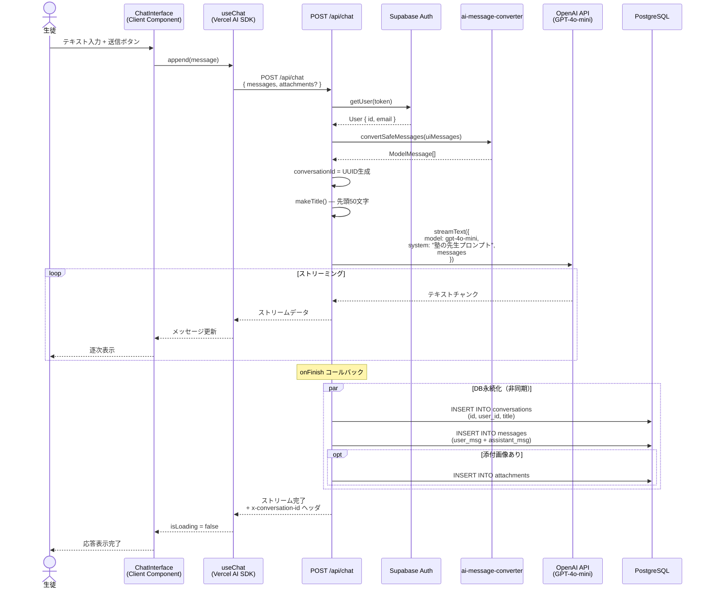
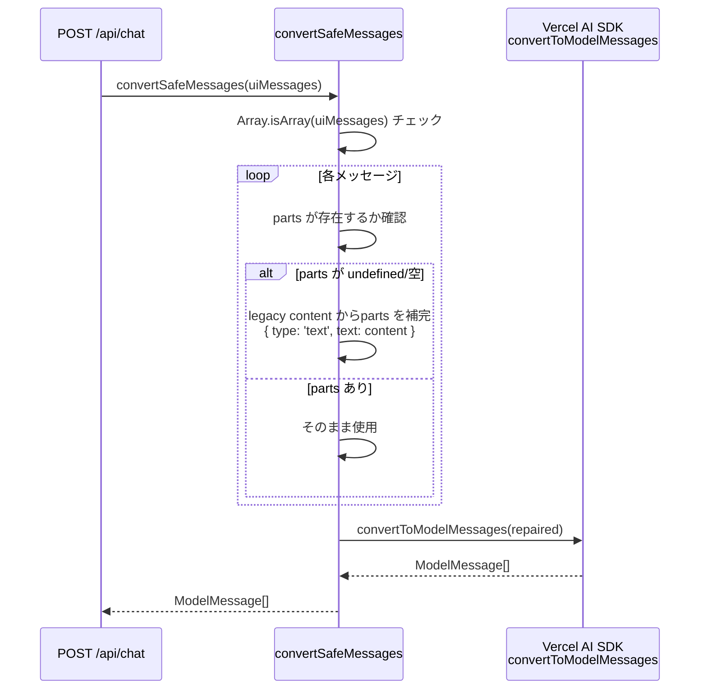

# 3. AIチャットフロー

### 3.1 基本チャットフロー

```mermaid
sequenceDiagram
    actor Student as 生徒
    participant Chat as ChatInterface<br/>(Client Component)
    participant Hook as useChat<br/>(Vercel AI SDK)
    participant API as POST /api/chat
    participant Auth as Supabase Auth
    participant Conv as ai-message-converter
    participant AI as OpenAI API<br/>(GPT-4o-mini)
    participant DB as PostgreSQL

    Student->>Chat: テキスト入力 + 送信ボタン
    Chat->>Hook: append(message)
    Hook->>API: POST /api/chat<br/>{ messages, attachments? }

    API->>Auth: getUser(token)
    Auth-->>API: User { id, email }

    API->>Conv: convertSafeMessages(uiMessages)
    Conv-->>API: ModelMessage[]

    API->>API: conversationId = UUID生成
    API->>API: makeTitle() — 先頭50文字

    API->>AI: streamText({<br/>  model: gpt-4o-mini,<br/>  system: "塾の先生プロンプト",<br/>  messages<br/>})

    loop ストリーミング
        AI-->>API: テキストチャンク
        API-->>Hook: ストリームデータ
        Hook-->>Chat: メッセージ更新
        Chat-->>Student: 逐次表示
    end

    Note over API: onFinish コールバック

    par DB永続化（非同期）
        API->>DB: INSERT INTO conversations<br/>(id, user_id, title)
        API->>DB: INSERT INTO messages<br/>(user_msg + assistant_msg)

        opt 添付画像あり
            API->>DB: INSERT INTO attachments
        end
    end

    API-->>Hook: ストリーム完了<br/>+ x-conversation-id ヘッダ
    Hook-->>Chat: isLoading = false
    Chat-->>Student: 応答表示完了
```

### 3.2 メッセージ変換フロー

```mermaid
sequenceDiagram
    participant API as POST /api/chat
    participant Conv as convertSafeMessages
    participant SDK as Vercel AI SDK<br/>convertToModelMessages

    API->>Conv: convertSafeMessages(uiMessages)

    Conv->>Conv: Array.isArray(uiMessages) チェック

    loop 各メッセージ
        Conv->>Conv: parts が存在するか確認

        alt parts が undefined/空
            Conv->>Conv: legacy content からparts を補完<br/>{ type: 'text', text: content }
        else parts あり
            Conv->>Conv: そのまま使用
        end
    end

    Conv->>SDK: convertToModelMessages(repaired)
    SDK-->>Conv: ModelMessage[]
    Conv-->>API: ModelMessage[]
```

---

> **文書バージョン**: 1.0
> **作成日**: 2026-03-01
> **最終更新日**: 2026-03-01
