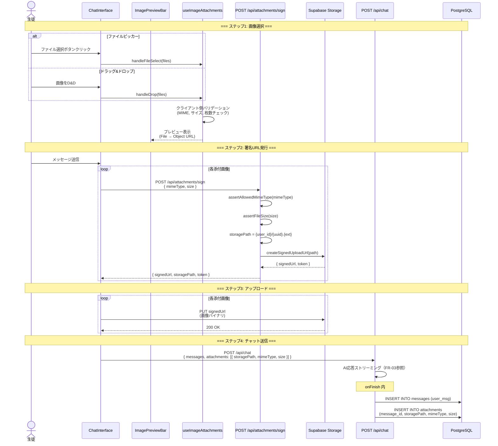
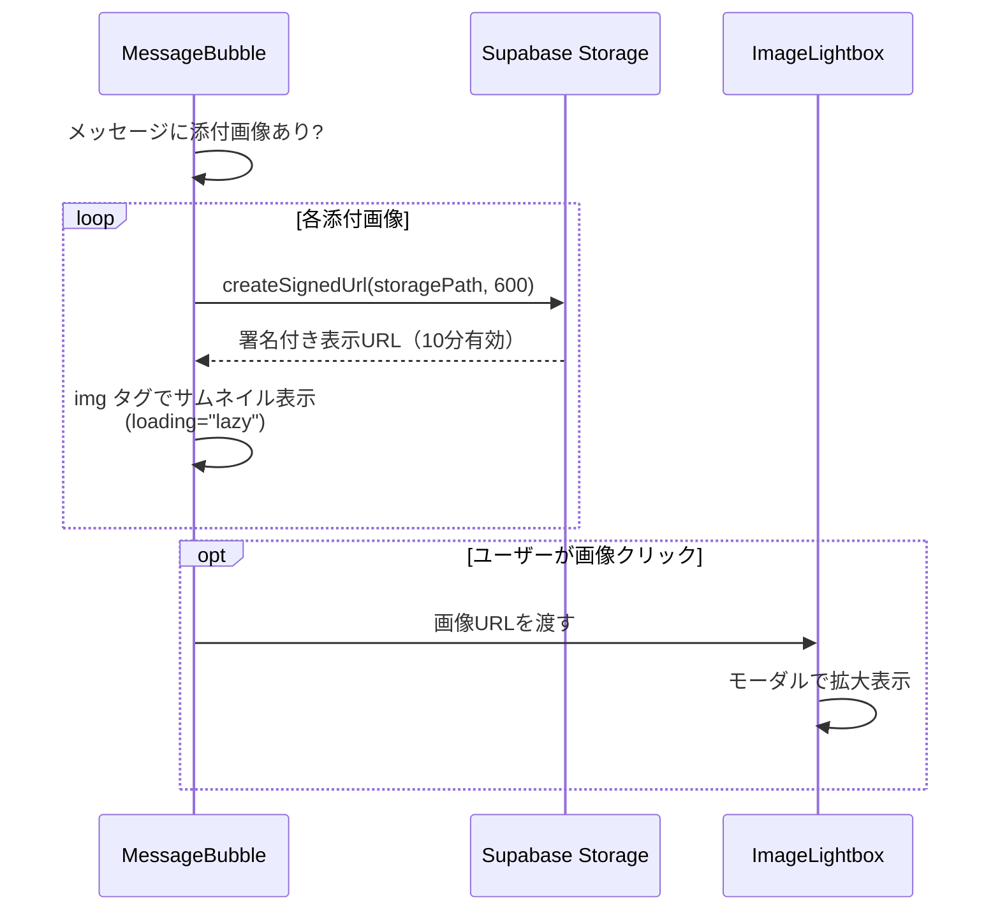

# 4. 画像添付フロー

### 4.1 画像アップロード〜チャット送信

```mermaid
sequenceDiagram
    actor Student as 生徒
    participant Chat as ChatInterface
    participant Preview as ImagePreviewBar
    participant Hook as useImageAttachments
    participant SignAPI as POST /api/attachments/sign
    participant Storage as Supabase Storage
    participant ChatAPI as POST /api/chat
    participant DB as PostgreSQL

    Note over Student, DB: === ステップ1: 画像選択 ===

    alt ファイルピッカー
        Student->>Chat: ファイル選択ボタンクリック
        Chat->>Hook: handleFileSelect(files)
    else ドラッグ&ドロップ
        Student->>Chat: 画像をD&D
        Chat->>Hook: handleDrop(files)
    end

    Hook->>Hook: クライアント側バリデーション<br/>(MIME, サイズ, 枚数チェック)
    Hook-->>Preview: プレビュー表示<br/>(File → Object URL)

    Note over Student, DB: === ステップ2: 署名URL発行 ===

    Student->>Chat: メッセージ送信

    loop 各添付画像
        Chat->>SignAPI: POST /api/attachments/sign<br/>{ mimeType, size }

        SignAPI->>SignAPI: assertAllowedMimeType(mimeType)
        SignAPI->>SignAPI: assertFileSize(size)
        SignAPI->>SignAPI: storagePath = {user_id}/{uuid}.{ext}

        SignAPI->>Storage: createSignedUploadUrl(path)
        Storage-->>SignAPI: { signedUrl, token }
        SignAPI-->>Chat: { signedUrl, storagePath, token }
    end

    Note over Student, DB: === ステップ3: アップロード ===

    loop 各添付画像
        Chat->>Storage: PUT signedUrl<br/>(画像バイナリ)
        Storage-->>Chat: 200 OK
    end

    Note over Student, DB: === ステップ4: チャット送信 ===

    Chat->>ChatAPI: POST /api/chat<br/>{ messages, attachments: [{ storagePath, mimeType, size }] }

    ChatAPI->>ChatAPI: AI応答ストリーミング（FR-03参照）

    Note over ChatAPI: onFinish 内
    ChatAPI->>DB: INSERT INTO messages (user_msg)
    ChatAPI->>DB: INSERT INTO attachments<br/>(message_id, storagePath, mimeType, size)
```

### 4.2 画像表示フロー

```mermaid
sequenceDiagram
    participant Bubble as MessageBubble
    participant Storage as Supabase Storage
    participant Lightbox as ImageLightbox

    Bubble->>Bubble: メッセージに添付画像あり?

    loop 各添付画像
        Bubble->>Storage: createSignedUrl(storagePath, 600)
        Storage-->>Bubble: 署名付き表示URL（10分有効）
        Bubble->>Bubble: img タグでサムネイル表示<br/>(loading="lazy")
    end

    opt ユーザーが画像クリック
        Bubble->>Lightbox: 画像URLを渡す
        Lightbox->>Lightbox: モーダルで拡大表示
    end
```

---

> **文書バージョン**: 1.0
> **作成日**: 2026-03-01
> **最終更新日**: 2026-03-01
