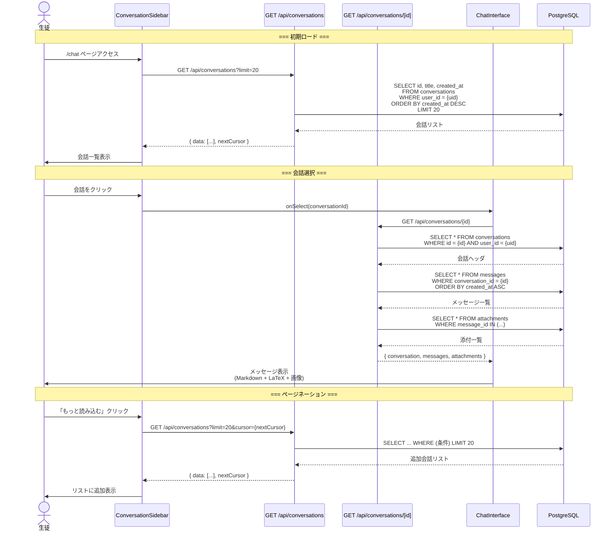

# 5. 会話履歴閲覧フロー

### 5.1 サイドバー表示・会話選択

```mermaid
sequenceDiagram
    actor Student as 生徒
    participant Sidebar as ConversationSidebar
    participant ListAPI as GET /api/conversations
    participant DetailAPI as GET /api/conversations/[id]
    participant Chat as ChatInterface
    participant DB as PostgreSQL

    Note over Student, DB: === 初期ロード ===

    Student->>Sidebar: /chat ページアクセス
    Sidebar->>ListAPI: GET /api/conversations?limit=20
    ListAPI->>DB: SELECT id, title, created_at<br/>FROM conversations<br/>WHERE user_id = {uid}<br/>ORDER BY created_at DESC<br/>LIMIT 20
    DB-->>ListAPI: 会話リスト
    ListAPI-->>Sidebar: { data: [...], nextCursor }
    Sidebar->>Student: 会話一覧表示

    Note over Student, DB: === 会話選択 ===

    Student->>Sidebar: 会話をクリック
    Sidebar->>Chat: onSelect(conversationId)
    Chat->>DetailAPI: GET /api/conversations/{id}

    DetailAPI->>DB: SELECT * FROM conversations<br/>WHERE id = {id} AND user_id = {uid}
    DB-->>DetailAPI: 会話ヘッダ

    DetailAPI->>DB: SELECT * FROM messages<br/>WHERE conversation_id = {id}<br/>ORDER BY created_at ASC
    DB-->>DetailAPI: メッセージ一覧

    DetailAPI->>DB: SELECT * FROM attachments<br/>WHERE message_id IN (...)
    DB-->>DetailAPI: 添付一覧

    DetailAPI-->>Chat: { conversation, messages, attachments }
    Chat->>Student: メッセージ表示<br/>(Markdown + LaTeX + 画像)

    Note over Student, DB: === ページネーション ===

    Student->>Sidebar: 「もっと読み込む」クリック
    Sidebar->>ListAPI: GET /api/conversations?limit=20&cursor={nextCursor}
    ListAPI->>DB: SELECT ... WHERE (条件) LIMIT 20
    DB-->>ListAPI: 追加会話リスト
    ListAPI-->>Sidebar: { data: [...], nextCursor }
    Sidebar->>Student: リストに追加表示
```

---

> **文書バージョン**: 1.0
> **作成日**: 2026-03-01
> **最終更新日**: 2026-03-01
