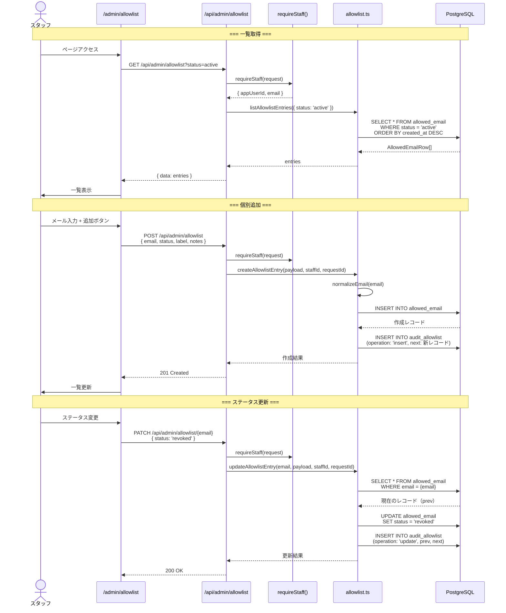
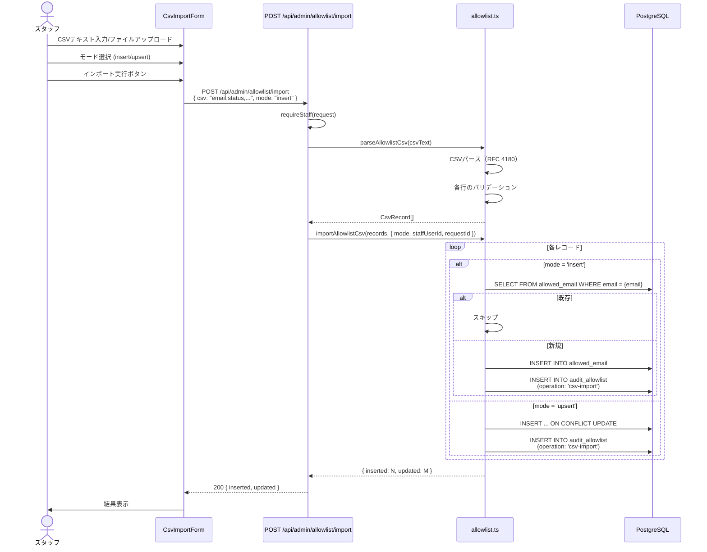

# 6. 許可リスト管理フロー

### 6.1 個別追加・更新

```mermaid
sequenceDiagram
    actor Staff as スタッフ
    participant UI as /admin/allowlist
    participant API as /api/admin/allowlist
    participant Require as requireStaff()
    participant Service as allowlist.ts
    participant DB as PostgreSQL

    Note over Staff, DB: === 一覧取得 ===

    Staff->>UI: ページアクセス
    UI->>API: GET /api/admin/allowlist?status=active
    API->>Require: requireStaff(request)
    Require-->>API: { appUserId, email }
    API->>Service: listAllowlistEntries({ status: 'active' })
    Service->>DB: SELECT * FROM allowed_email<br/>WHERE status = 'active'<br/>ORDER BY created_at DESC
    DB-->>Service: AllowedEmailRow[]
    Service-->>API: entries
    API-->>UI: { data: entries }
    UI->>Staff: 一覧表示

    Note over Staff, DB: === 個別追加 ===

    Staff->>UI: メール入力 + 追加ボタン
    UI->>API: POST /api/admin/allowlist<br/>{ email, status, label, notes }
    API->>Require: requireStaff(request)
    API->>Service: createAllowlistEntry(payload, staffId, requestId)

    Service->>Service: normalizeEmail(email)
    Service->>DB: INSERT INTO allowed_email
    DB-->>Service: 作成レコード
    Service->>DB: INSERT INTO audit_allowlist<br/>(operation: 'insert', next: 新レコード)

    Service-->>API: 作成結果
    API-->>UI: 201 Created
    UI->>Staff: 一覧更新

    Note over Staff, DB: === ステータス更新 ===

    Staff->>UI: ステータス変更
    UI->>API: PATCH /api/admin/allowlist/{email}<br/>{ status: 'revoked' }
    API->>Require: requireStaff(request)
    API->>Service: updateAllowlistEntry(email, payload, staffId, requestId)

    Service->>DB: SELECT * FROM allowed_email<br/>WHERE email = {email}
    DB-->>Service: 現在のレコード（prev）

    Service->>DB: UPDATE allowed_email<br/>SET status = 'revoked'
    Service->>DB: INSERT INTO audit_allowlist<br/>(operation: 'update', prev, next)

    Service-->>API: 更新結果
    API-->>UI: 200 OK
```

### 6.2 CSV一括インポート

```mermaid
sequenceDiagram
    actor Staff as スタッフ
    participant UI as CsvImportForm
    participant API as POST /api/admin/allowlist/import
    participant Service as allowlist.ts
    participant DB as PostgreSQL

    Staff->>UI: CSVテキスト入力/ファイルアップロード
    Staff->>UI: モード選択 (insert/upsert)
    Staff->>UI: インポート実行ボタン

    UI->>API: POST /api/admin/allowlist/import<br/>{ csv: "email,status,...", mode: "insert" }

    API->>API: requireStaff(request)
    API->>Service: parseAllowlistCsv(csvText)

    Service->>Service: CSVパース（RFC 4180）
    Service->>Service: 各行のバリデーション
    Service-->>API: CsvRecord[]

    API->>Service: importAllowlistCsv(records, { mode, staffUserId, requestId })

    loop 各レコード
        alt mode = 'insert'
            Service->>DB: SELECT FROM allowed_email WHERE email = {email}
            alt 既存
                Service->>Service: スキップ
            else 新規
                Service->>DB: INSERT INTO allowed_email
                Service->>DB: INSERT INTO audit_allowlist<br/>(operation: 'csv-import')
            end
        else mode = 'upsert'
            Service->>DB: INSERT ... ON CONFLICT UPDATE
            Service->>DB: INSERT INTO audit_allowlist<br/>(operation: 'csv-import')
        end
    end

    Service-->>API: { inserted: N, updated: M }
    API-->>UI: 200 { inserted, updated }
    UI->>Staff: 結果表示
```

---

> **文書バージョン**: 1.0
> **作成日**: 2026-03-01
> **最終更新日**: 2026-03-01
