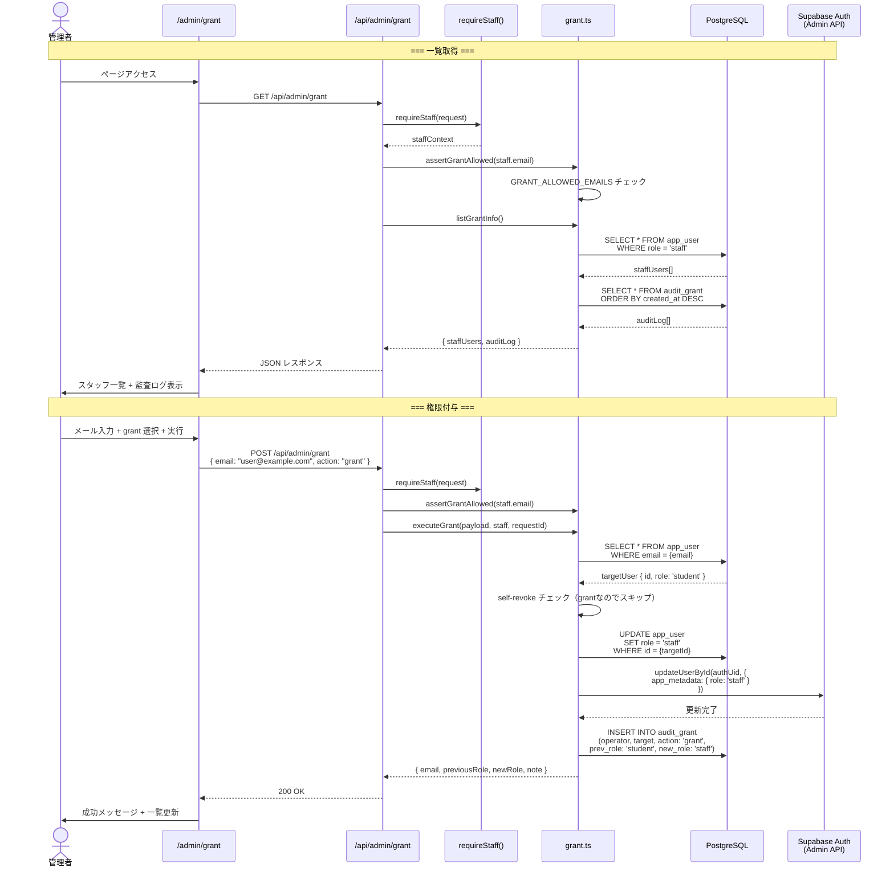
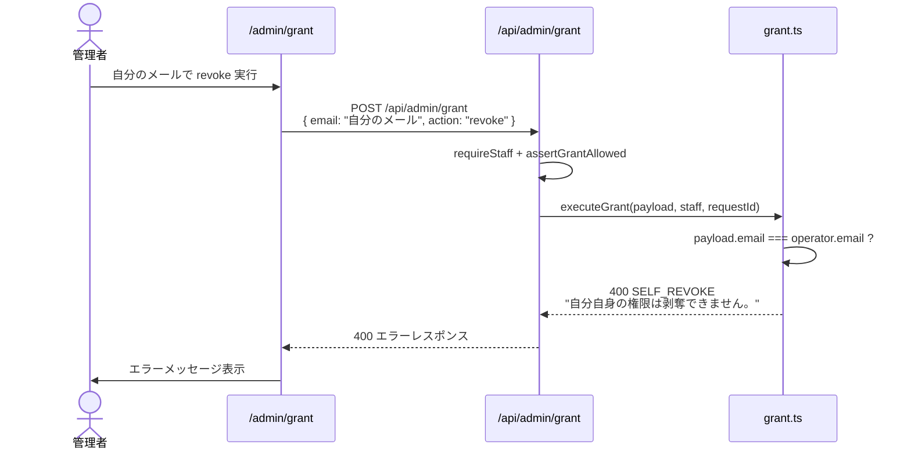

# 7. スタッフ権限管理フロー

### 7.1 権限付与（grant）

```mermaid
sequenceDiagram
    actor Admin as 管理者
    participant UI as /admin/grant
    participant API as /api/admin/grant
    participant Require as requireStaff()
    participant Grant as grant.ts
    participant DB as PostgreSQL
    participant AuthAdmin as Supabase Auth<br/>(Admin API)

    Note over Admin, AuthAdmin: === 一覧取得 ===

    Admin->>UI: ページアクセス
    UI->>API: GET /api/admin/grant
    API->>Require: requireStaff(request)
    Require-->>API: staffContext
    API->>Grant: assertGrantAllowed(staff.email)
    Grant->>Grant: GRANT_ALLOWED_EMAILS チェック
    API->>Grant: listGrantInfo()

    Grant->>DB: SELECT * FROM app_user<br/>WHERE role = 'staff'
    DB-->>Grant: staffUsers[]
    Grant->>DB: SELECT * FROM audit_grant<br/>ORDER BY created_at DESC
    DB-->>Grant: auditLog[]

    Grant-->>API: { staffUsers, auditLog }
    API-->>UI: JSON レスポンス
    UI->>Admin: スタッフ一覧 + 監査ログ表示

    Note over Admin, AuthAdmin: === 権限付与 ===

    Admin->>UI: メール入力 + grant 選択 + 実行
    UI->>API: POST /api/admin/grant<br/>{ email: "user@example.com", action: "grant" }

    API->>Require: requireStaff(request)
    API->>Grant: assertGrantAllowed(staff.email)
    API->>Grant: executeGrant(payload, staff, requestId)

    Grant->>DB: SELECT * FROM app_user<br/>WHERE email = {email}
    DB-->>Grant: targetUser { id, role: 'student' }

    Grant->>Grant: self-revoke チェック（grantなのでスキップ）

    Grant->>DB: UPDATE app_user<br/>SET role = 'staff'<br/>WHERE id = {targetId}

    Grant->>AuthAdmin: updateUserById(authUid, {<br/>  app_metadata: { role: 'staff' }<br/>})
    AuthAdmin-->>Grant: 更新完了

    Grant->>DB: INSERT INTO audit_grant<br/>(operator, target, action: 'grant',<br/> prev_role: 'student', new_role: 'staff')

    Grant-->>API: { email, previousRole, newRole, note }
    API-->>UI: 200 OK
    UI->>Admin: 成功メッセージ + 一覧更新
```

### 7.2 権限剥奪（revoke）— 自己剥奪エラー

```mermaid
sequenceDiagram
    actor Admin as 管理者
    participant UI as /admin/grant
    participant API as /api/admin/grant
    participant Grant as grant.ts

    Admin->>UI: 自分のメールで revoke 実行
    UI->>API: POST /api/admin/grant<br/>{ email: "自分のメール", action: "revoke" }

    API->>API: requireStaff + assertGrantAllowed
    API->>Grant: executeGrant(payload, staff, requestId)

    Grant->>Grant: payload.email === operator.email ?
    Grant-->>API: 400 SELF_REVOKE<br/>"自分自身の権限は剥奪できません。"

    API-->>UI: 400 エラーレスポンス
    UI->>Admin: エラーメッセージ表示
```

---

> **文書バージョン**: 1.0
> **作成日**: 2026-03-01
> **最終更新日**: 2026-03-01
