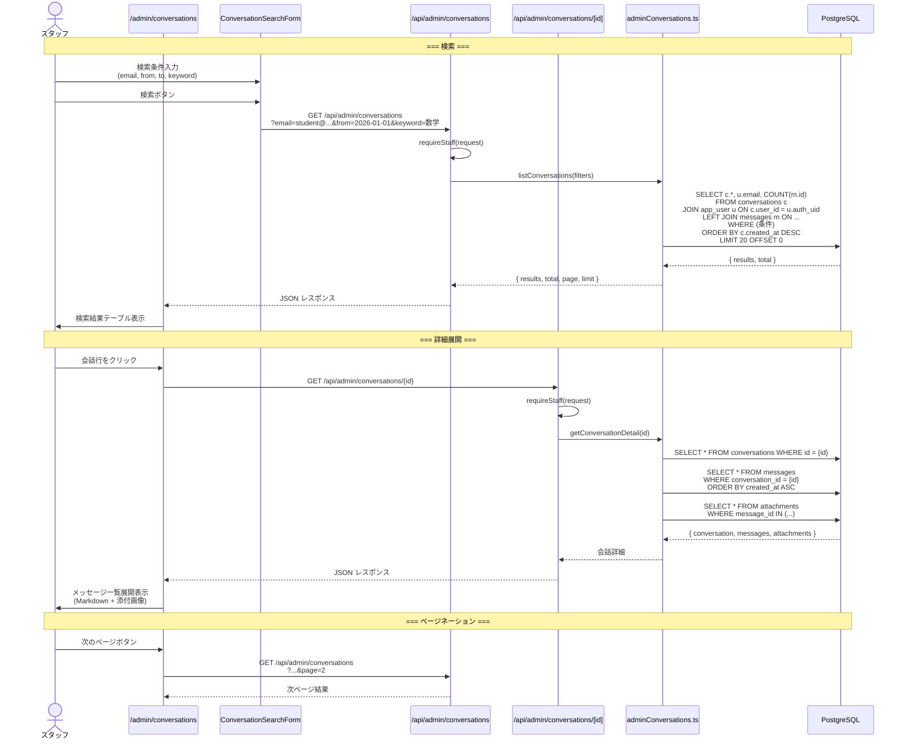

# 8. 管理者会話検索フロー

```mermaid
sequenceDiagram
    actor Staff as スタッフ
    participant UI as /admin/conversations
    participant Search as ConversationSearchForm
    participant API as /api/admin/conversations
    participant DetailAPI as /api/admin/conversations/[id]
    participant Service as adminConversations.ts
    participant DB as PostgreSQL

    Note over Staff, DB: === 検索 ===

    Staff->>Search: 検索条件入力<br/>(email, from, to, keyword)
    Staff->>Search: 検索ボタン

    Search->>API: GET /api/admin/conversations<br/>?email=student@...&from=2026-01-01&keyword=数学

    API->>API: requireStaff(request)
    API->>Service: listConversations(filters)

    Service->>DB: SELECT c.*, u.email, COUNT(m.id)<br/>FROM conversations c<br/>JOIN app_user u ON c.user_id = u.auth_uid<br/>LEFT JOIN messages m ON ...<br/>WHERE (条件)<br/>ORDER BY c.created_at DESC<br/>LIMIT 20 OFFSET 0
    DB-->>Service: { results, total }

    Service-->>API: { results, total, page, limit }
    API-->>UI: JSON レスポンス
    UI->>Staff: 検索結果テーブル表示

    Note over Staff, DB: === 詳細展開 ===

    Staff->>UI: 会話行をクリック
    UI->>DetailAPI: GET /api/admin/conversations/{id}

    DetailAPI->>DetailAPI: requireStaff(request)
    DetailAPI->>Service: getConversationDetail(id)

    Service->>DB: SELECT * FROM conversations WHERE id = {id}
    Service->>DB: SELECT * FROM messages<br/>WHERE conversation_id = {id}<br/>ORDER BY created_at ASC
    Service->>DB: SELECT * FROM attachments<br/>WHERE message_id IN (...)

    DB-->>Service: { conversation, messages, attachments }
    Service-->>DetailAPI: 会話詳細
    DetailAPI-->>UI: JSON レスポンス

    UI->>Staff: メッセージ一覧展開表示<br/>(Markdown + 添付画像)

    Note over Staff, DB: === ページネーション ===

    Staff->>UI: 次のページボタン
    UI->>API: GET /api/admin/conversations<br/>?...&page=2
    API-->>UI: 次ページ結果
```

---

> **文書バージョン**: 1.0
> **作成日**: 2026-03-01
> **最終更新日**: 2026-03-01
