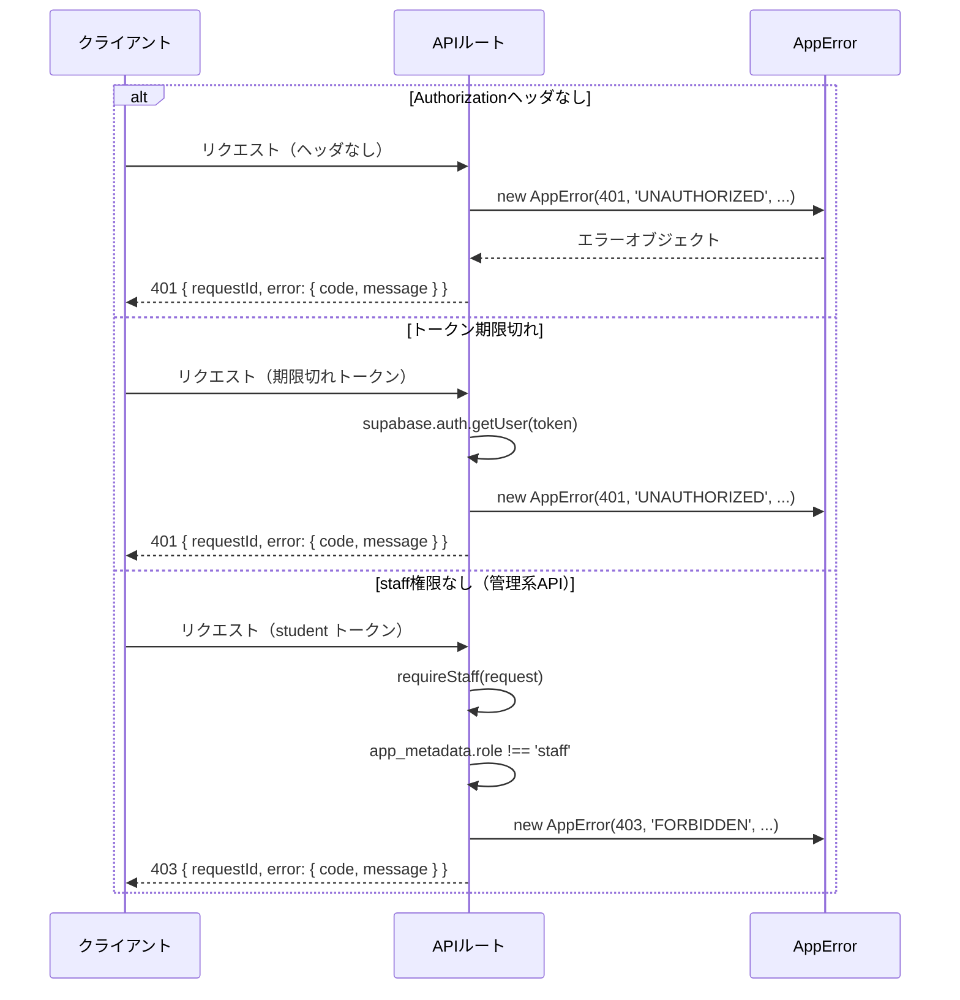
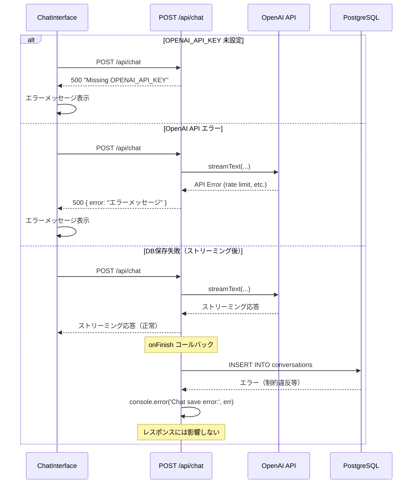
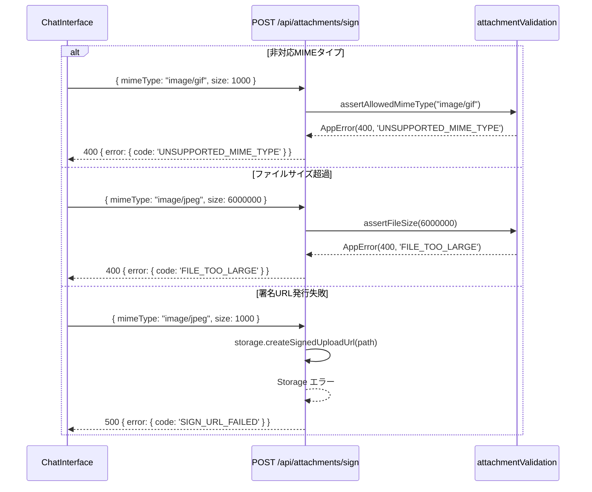
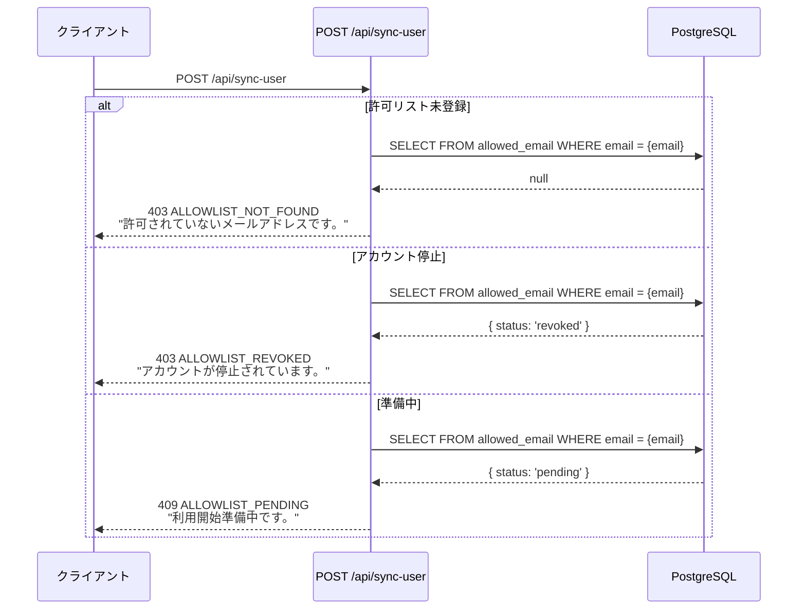

# 9. エラーハンドリングシーケンス

### 9.1 認証エラー（共通）

```mermaid
sequenceDiagram
    participant Client as クライアント
    participant API as APIルート
    participant Error as AppError

    alt Authorizationヘッダなし
        Client->>API: リクエスト（ヘッダなし）
        API->>Error: new AppError(401, 'UNAUTHORIZED', ...)
        Error-->>API: エラーオブジェクト
        API-->>Client: 401 { requestId, error: { code, message } }

    else トークン期限切れ
        Client->>API: リクエスト（期限切れトークン）
        API->>API: supabase.auth.getUser(token)
        API->>Error: new AppError(401, 'UNAUTHORIZED', ...)
        API-->>Client: 401 { requestId, error: { code, message } }

    else staff権限なし（管理系API）
        Client->>API: リクエスト（student トークン）
        API->>API: requireStaff(request)
        API->>API: app_metadata.role !== 'staff'
        API->>Error: new AppError(403, 'FORBIDDEN', ...)
        API-->>Client: 403 { requestId, error: { code, message } }
    end
```

### 9.2 チャットエラー

```mermaid
sequenceDiagram
    participant Client as ChatInterface
    participant API as POST /api/chat
    participant AI as OpenAI API
    participant DB as PostgreSQL

    alt OPENAI_API_KEY 未設定
        Client->>API: POST /api/chat
        API-->>Client: 500 "Missing OPENAI_API_KEY"
        Client->>Client: エラーメッセージ表示

    else OpenAI API エラー
        Client->>API: POST /api/chat
        API->>AI: streamText(...)
        AI-->>API: API Error (rate limit, etc.)
        API-->>Client: 500 { error: "エラーメッセージ" }
        Client->>Client: エラーメッセージ表示

    else DB保存失敗（ストリーミング後）
        Client->>API: POST /api/chat
        API->>AI: streamText(...)
        AI-->>API: ストリーミング応答
        API-->>Client: ストリーミング応答（正常）

        Note over API: onFinish コールバック
        API->>DB: INSERT INTO conversations
        DB-->>API: エラー（制約違反等）
        API->>API: console.error('Chat save error:', err)
        Note over API: レスポンスには影響しない
    end
```

### 9.3 画像添付エラー

```mermaid
sequenceDiagram
    participant Client as ChatInterface
    participant API as POST /api/attachments/sign
    participant Validation as attachmentValidation

    alt 非対応MIMEタイプ
        Client->>API: { mimeType: "image/gif", size: 1000 }
        API->>Validation: assertAllowedMimeType("image/gif")
        Validation-->>API: AppError(400, 'UNSUPPORTED_MIME_TYPE')
        API-->>Client: 400 { error: { code: 'UNSUPPORTED_MIME_TYPE' } }

    else ファイルサイズ超過
        Client->>API: { mimeType: "image/jpeg", size: 6000000 }
        API->>Validation: assertFileSize(6000000)
        Validation-->>API: AppError(400, 'FILE_TOO_LARGE')
        API-->>Client: 400 { error: { code: 'FILE_TOO_LARGE' } }

    else 署名URL発行失敗
        Client->>API: { mimeType: "image/jpeg", size: 1000 }
        API->>API: storage.createSignedUploadUrl(path)
        API-->>API: Storage エラー
        API-->>Client: 500 { error: { code: 'SIGN_URL_FAILED' } }
    end
```

### 9.4 Allowlistエラー

```mermaid
sequenceDiagram
    participant Client as クライアント
    participant API as POST /api/sync-user
    participant DB as PostgreSQL

    Client->>API: POST /api/sync-user

    alt 許可リスト未登録
        API->>DB: SELECT FROM allowed_email WHERE email = {email}
        DB-->>API: null
        API-->>Client: 403 ALLOWLIST_NOT_FOUND<br/>"許可されていないメールアドレスです。"

    else アカウント停止
        API->>DB: SELECT FROM allowed_email WHERE email = {email}
        DB-->>API: { status: 'revoked' }
        API-->>Client: 403 ALLOWLIST_REVOKED<br/>"アカウントが停止されています。"

    else 準備中
        API->>DB: SELECT FROM allowed_email WHERE email = {email}
        DB-->>API: { status: 'pending' }
        API-->>Client: 409 ALLOWLIST_PENDING<br/>"利用開始準備中です。"
    end
```

---

> **文書バージョン**: 1.0
> **作成日**: 2026-03-01
> **最終更新日**: 2026-03-01
