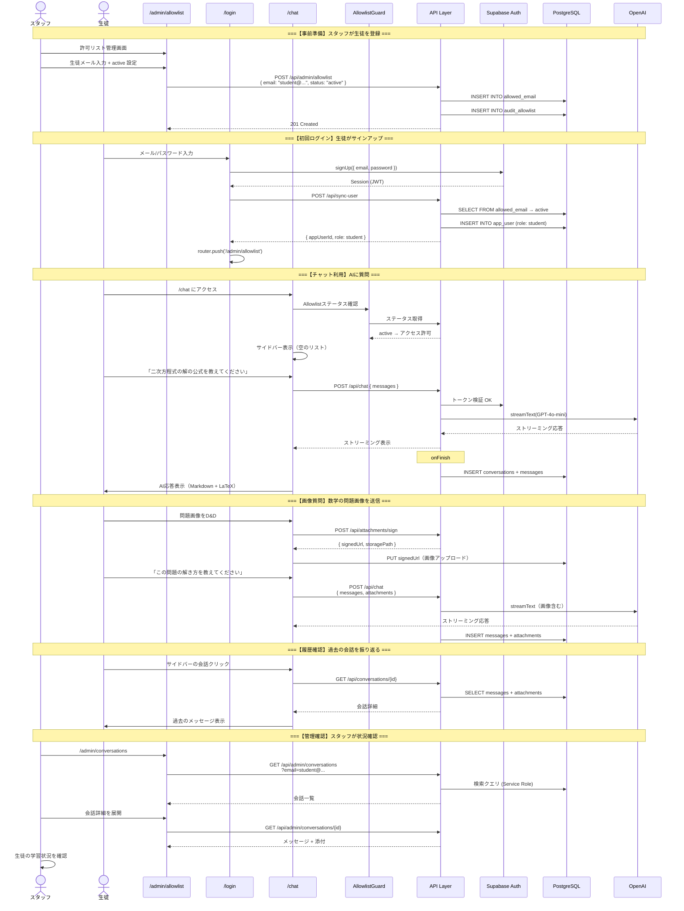

# 10. 完全なユーザージャーニー

### 10.1 新規生徒の初回利用〜チャット完了

```mermaid
sequenceDiagram
    actor Staff as スタッフ
    actor Student as 生徒
    participant AdminUI as /admin/allowlist
    participant LoginUI as /login
    participant ChatUI as /chat
    participant Guard as AllowlistGuard
    participant APIs as API Layer
    participant Auth as Supabase Auth
    participant DB as PostgreSQL
    participant AI as OpenAI

    Note over Staff, AI: ===【事前準備】スタッフが生徒を登録 ===

    Staff->>AdminUI: 許可リスト管理画面
    Staff->>AdminUI: 生徒メール入力 + active 設定
    AdminUI->>APIs: POST /api/admin/allowlist<br/>{ email: "student@...", status: "active" }
    APIs->>DB: INSERT INTO allowed_email
    APIs->>DB: INSERT INTO audit_allowlist
    APIs-->>AdminUI: 201 Created

    Note over Staff, AI: ===【初回ログイン】生徒がサインアップ ===

    Student->>LoginUI: メール/パスワード入力
    LoginUI->>Auth: signUp({ email, password })
    Auth-->>LoginUI: Session (JWT)

    LoginUI->>APIs: POST /api/sync-user
    APIs->>DB: SELECT FROM allowed_email → active
    APIs->>DB: INSERT INTO app_user (role: student)
    APIs-->>LoginUI: { appUserId, role: student }

    LoginUI->>LoginUI: router.push('/admin/allowlist')

    Note over Staff, AI: ===【チャット利用】AIに質問 ===

    Student->>ChatUI: /chat にアクセス
    ChatUI->>Guard: Allowlistステータス確認
    Guard->>APIs: ステータス取得
    APIs-->>Guard: active → アクセス許可

    ChatUI->>ChatUI: サイドバー表示（空のリスト）

    Student->>ChatUI: 「二次方程式の解の公式を教えてください」

    ChatUI->>APIs: POST /api/chat { messages }
    APIs->>Auth: トークン検証 OK
    APIs->>AI: streamText(GPT-4o-mini)
    AI-->>APIs: ストリーミング応答
    APIs-->>ChatUI: ストリーミング表示

    Note over APIs: onFinish
    APIs->>DB: INSERT conversations + messages

    ChatUI->>Student: AI応答表示（Markdown + LaTeX）

    Note over Staff, AI: ===【画像質問】数学の問題画像を送信 ===

    Student->>ChatUI: 問題画像をD&D
    ChatUI->>APIs: POST /api/attachments/sign
    APIs-->>ChatUI: { signedUrl, storagePath }
    ChatUI->>DB: PUT signedUrl（画像アップロード）

    Student->>ChatUI: 「この問題の解き方を教えてください」
    ChatUI->>APIs: POST /api/chat<br/>{ messages, attachments }
    APIs->>AI: streamText（画像含む）
    AI-->>ChatUI: ストリーミング応答

    APIs->>DB: INSERT messages + attachments

    Note over Staff, AI: ===【履歴確認】過去の会話を振り返る ===

    Student->>ChatUI: サイドバーの会話クリック
    ChatUI->>APIs: GET /api/conversations/{id}
    APIs->>DB: SELECT messages + attachments
    APIs-->>ChatUI: 会話詳細
    ChatUI->>Student: 過去のメッセージ表示

    Note over Staff, AI: ===【管理確認】スタッフが状況確認 ===

    Staff->>AdminUI: /admin/conversations
    AdminUI->>APIs: GET /api/admin/conversations<br/>?email=student@...
    APIs->>DB: 検索クエリ (Service Role)
    APIs-->>AdminUI: 会話一覧
    Staff->>AdminUI: 会話詳細を展開
    AdminUI->>APIs: GET /api/admin/conversations/{id}
    APIs-->>AdminUI: メッセージ + 添付
    Staff->>Staff: 生徒の学習状況を確認
```

---

> **文書バージョン**: 1.0
> **作成日**: 2026-03-01
> **最終更新日**: 2026-03-01
